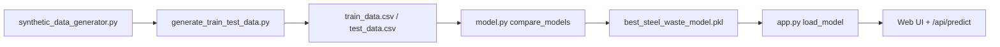

# Technical Appendix — Steel Waste ML System (Full)

This document describes the **implemented** system: repository layout, data pipeline, machine-learning stack, web/API layer, configuration, and how to run and extend it. It is intended for the **final report**, examiner review, and handover.

**Related files:** `SECOND_SEMESTER_ADDENDUM.md` (high-level semester narrative), `extension` (original proposal), `requirements.txt`, `model.py`, `app.py`.

---

## 1. Repository structure

```
Steel Waste/
├── app.py                          # Flask application (routes, prediction orchestration)
├── model.py                        # ModelComparison: train, compare, save/load, predict, explain, reliability, cost/CO₂
├── requirements.txt                # Python dependencies (pinned versions)
├── models/
│   └── best_steel_waste_model.pkl  # Serialized bundle (created after training; used at runtime)
├── data/
│   ├── train_data.csv              # Training split (generated)
│   ├── test_data.csv               # Test split (generated)
│   ├── full_dataset.csv            # Full synthetic set before split (generated)
│   ├── synthetic_steel_waste_parameters.csv  # Optional raw export from generator
│   ├── model_comparison_results.csv            # Metrics export from model.py
│   └── data_dictionary.xlsx        # Variable documentation (if present)
├── data_generation/
│   ├── synthetic_data_generator.py # SteelWasteDataGenerator — synthetic projects + target
│   └── generate_train_test_data.py # Builds CSVs under data/ (default 3000 projects, 80/20 split)
├── templates/                      # Jinja2 HTML (Flask)
│   ├── base.html
│   ├── index.html
│   ├── predict.html
│   ├── about.html
│   └── features.html
├── static/
│   ├── css/style.css
│   └── js/main.js
└── images/web_application/         # Screenshots for report (populate manually)
```

Legacy / design reference (not required to run the app): `design for thewebsite/`.

---

## 2. Dependencies (`requirements.txt`)

| Package        | Version  | Role |
|----------------|----------|------|
| Flask          | 3.0.0    | Web server, routing, templates |
| pandas         | 2.1.3    | DataFrames for features/target |
| numpy          | 1.24.3   | Numerics |
| scikit-learn   | 1.3.2    | Models, preprocessing, metrics, `NearestNeighbors` |
| xgboost        | 2.0.3    | `XGBRegressor` in model comparison |
| joblib         | 1.3.2    | Save/load `best_steel_waste_model.pkl` |
| shap           | 0.43.0   | Explainability (`TreeExplainer` / `KernelExplainer`) |

Install:

```bash
cd "/path/to/Steel Waste"
python -m venv .venv
source .venv/bin/activate   # Windows: .venv\Scripts\activate
pip install -r requirements.txt
```

---

## 3. End-to-end data and model pipeline



1. **Generate data:** Run `data_generation/generate_train_test_data.py`. It instantiates `SteelWasteDataGenerator`, produces `n_projects` rows (default **3000**), splits **80/20** with `random_state=42`, writes `data/train_data.csv`, `data/test_data.csv`, `data/full_dataset.csv`.

2. **Train and select best model:** Run `python model.py` (or train via `app.py` if the pickle is missing — see §6). This loads train/test CSVs, runs `ModelComparison.compare_models()`, saves `models/best_steel_waste_model.pkl` and `data/model_comparison_results.csv`.

3. **Serve predictions:** Run `python app.py`. The app loads the pickle once (singleton), serves HTML and JSON predictions.

**Target variable (CSV columns):** `steel_waste_percentage` — excluded from features; predicted by the regressor.

**Excluded from features:** `project_id` (identifier only).

---

## 4. Feature schema (model input)

All feature columns are read from the training DataFrame except `project_id` and `steel_waste_percentage`. The **current** pipeline uses these **15** features (names must match CSV / API):

| Column name | Type | Notes |
|-------------|------|--------|
| `reinforcement_ratio_kg_per_m3` | float | kg/m³ |
| `num_unique_required_lengths` | int | Count of distinct required bar lengths |
| `stock_length_policy` | categorical | `standard_12m`, `mixed_lengths`, `custom_lengths` |
| `cutting_optimization_usage` | int | Typically 0–2 (none / partial / full encoded as integers in data) |
| `bim_integration_level` | int | 0–3 |
| `design_revisions_per_month` | int | |
| `supervision_index_1to5` | int | 1–5 |
| `material_control_level_1to3` | int | 1–3 |
| `storage_handling_index_1to5` | int | 1–5 |
| `offcut_reuse_policy_0to2` | int | 0–2 |
| `change_orders_per_month` | int | |
| `contract_type` | categorical | **Training data:** `lump_sum`, `design_build`, `remeasurement` |
| `lead_time_days` | int | |
| `order_frequency_per_month` | int | |
| `project_phase` | categorical | `foundation`, `frame`, `slab_finishing` |

**Preprocessing (`ModelComparison.prepare_features`):**

- **Label encoding (fit on train):** `stock_length_policy`, `contract_type`, `project_phase`.
- **Scaling:** `StandardScaler` fit on training features; same transform at prediction time.
- **Unknown categories at predict time:** Using values never seen in training can break `LabelEncoder.transform`; keep inputs within the training vocabulary.

---

## 5. Machine learning: models and selection

**Class:** `ModelComparison` in `model.py`.

**Compared regressors (10):** Random Forest, Gradient Boosting, XGBoost, Extra Trees, AdaBoost, Decision Tree, Linear Regression, Ridge, Lasso, Elastic Net. Hyperparameters are set in `get_models()`.

**Procedure (summary):**

- `prepare_features` on train/test with `is_training=True` for train (fit encoders + scaler) and `is_training=False` for test (transform only).
- K-fold cross-validation (default **10** folds) for each model.
- Metrics: MAE, RMSE, R², MAPE (and CV summaries logged in results).
- **Best model** chosen by test-set performance logic inside `compare_models` (see code); persisted to pickle.

**Saved artifact (`best_steel_waste_model.pkl`)** — dictionary serialized with `joblib`, including:

- `model` — fitted estimator  
- `model_name` — string  
- `label_encoders`, `scaler`, `feature_columns`  
- `X_train_scaled` — scaled training matrix for **reliability** (k-NN distance)  
- `metadata` — e.g. `created_at`, `test_mae`, `test_rmse`, `test_r2`, CV stats, `feature_importance`  

**Note:** The SHAP explainer is **not** stored in the pickle; it is **reconstructed on load** when SHAP is installed and training data are available.

---

## 6. Post-prediction analytics (same class)

### 6.1 `predict(df)`

Returns `numpy` array of predicted `steel_waste_percentage` per row.

### 6.2 `explain_prediction(df, top_n=5)`

- If SHAP is available and `shap_explainer` is initialized: **SHAP** contributions per feature for the instance; top `top_n` by absolute contribution. Positive contribution ⇒ higher predicted waste; negative ⇒ lower.
- Else if the model exposes `feature_importances_`: **Feature Importance** ranking (global importances, not instance-level SHAP).
- Else: `Not Available`.

### 6.3 `calculate_reliability(df)`

Uses **`X_train_scaled`** and `sklearn.neighbors.NearestNeighbors` (Euclidean, k = min(10, n_train)):

- Mean distance to neighbors → distance score vs approximate training percentile.
- Mean normalized z-distance to training feature means → second score.
- **Combined:** `0.6 * distance_score + 0.4 * normalized_score` → `reliability_score` ∈ [0, 1].
- **Levels:** `high` (≥ 0.7), `medium` (≥ 0.4), `low` (< 0.4) plus a human-readable `message`.

If `X_train_scaled` is missing, returns medium reliability with a fallback message.

### 6.4 `calculate_cost_co2_impact(waste_percentage, total_steel_kg, steel_cost_per_kg=0.8, co2_per_kg_steel=2.5)`

- `waste_kg = (waste_percentage/100) * total_steel_kg`
- `waste_cost_usd = waste_kg * steel_cost_per_kg`
- `waste_co2_kg = waste_kg * co2_per_kg_steel`
- **Potential savings** assume target waste = **50%** of predicted waste (`target_waste_percentage = waste_percentage * 0.5`); savings are the delta in kg, USD, and kg CO₂.

Defaults are documented in code (Middle East–oriented cost / industry-style CO₂ factor). To change economics for the report, edit defaults in `model.py` or extend `app.py` to pass parameters from the form/API.

---

## 7. Web application (`app.py`)

**Framework:** Flask 3. **Template engine:** Jinja2. **UI:** Bootstrap + custom CSS.

### 7.1 HTTP routes

| Method | Path | Purpose |
|--------|------|---------|
| GET | `/` | Landing page |
| GET | `/predict` | Prediction form (empty result state) |
| POST | `/predict` | Form submit → predict, explain, reliability, cost/CO₂ → re-render `predict.html` |
| GET | `/about` | Project / team description |
| GET | `/features` | Feature list for evaluators |
| GET | `/debug/explain` | Sample explainability JSON (**disable or protect in production**) |
| POST | `/api/predict` | JSON body → JSON response (see §7.3) |

**Server defaults:** `host='0.0.0.0'`, `port=5005`, `debug=True` in `if __name__ == '__main__'` — use a production WSGI server and turn off debug for real deployment.

### 7.2 Form field → DataFrame column mapping (POST `/predict`)

| Form `name` | Column in `data` dict |
|-------------|------------------------|
| `project_id` | `project_id` |
| `reinforcement_ratio` | `reinforcement_ratio_kg_per_m3` |
| `num_unique_lengths` | `num_unique_required_lengths` |
| `stock_length_policy` | `stock_length_policy` |
| `cutting_optimization` | `cutting_optimization_usage` |
| `bim_integration` | `bim_integration_level` |
| `design_revisions` | `design_revisions_per_month` |
| `supervision_index` | `supervision_index_1to5` |
| `material_control` | `material_control_level_1to3` |
| `storage_handling` | `storage_handling_index_1to5` |
| `offcut_reuse` | `offcut_reuse_policy_0to2` |
| `change_orders` | `change_orders_per_month` |
| `contract_type` | `contract_type` |
| `lead_time` | `lead_time_days` |
| `order_frequency` | `order_frequency_per_month` |
| `project_phase` | `project_phase` |
| `total_steel_kg` | (passed only to cost/CO₂; not a model feature) |

### 7.3 JSON API: `POST /api/predict`

**Content-Type:** `application/json`

**Body:** One object with the **model feature keys** (same names as CSV columns) plus optional `total_steel_kg` (defaults to 100000 in code).

**Example:**

```json
{
  "project_id": "P1001",
  "reinforcement_ratio_kg_per_m3": 120,
  "num_unique_required_lengths": 20,
  "stock_length_policy": "standard_12m",
  "cutting_optimization_usage": 0,
  "bim_integration_level": 0,
  "design_revisions_per_month": 2,
  "supervision_index_1to5": 3,
  "material_control_level_1to3": 2,
  "storage_handling_index_1to5": 3,
  "offcut_reuse_policy_0to2": 0,
  "change_orders_per_month": 1,
  "contract_type": "lump_sum",
  "lead_time_days": 15,
  "order_frequency_per_month": 4,
  "project_phase": "frame",
  "total_steel_kg": 100000
}
```

**Success response (200):** `success`, `predicted_waste_percentage`, `waste_category`, `reliability`, `explainability`, `cost_co2_impact`.

**Error (400):** `success: false`, `error` message.

**Example (curl):**

```bash
curl -s -X POST http://localhost:5005/api/predict \
  -H "Content-Type: application/json" \
  -d '{"reinforcement_ratio_kg_per_m3":120,"num_unique_required_lengths":20,"stock_length_policy":"standard_12m","cutting_optimization_usage":0,"bim_integration_level":0,"design_revisions_per_month":2,"supervision_index_1to5":3,"material_control_level_1to3":2,"storage_handling_index_1to5":3,"offcut_reuse_policy_0to2":0,"change_orders_per_month":1,"contract_type":"lump_sum","lead_time_days":15,"order_frequency_per_month":4,"project_phase":"frame","total_steel_kg":100000}'
```

---

## 8. Training and running (commands)

```bash
# 1) Generate train/test CSVs (from project root)
python data_generation/generate_train_test_data.py

# 2) Train all models, save best, export metrics
python model.py

# 3) Run web app (loads models/best_steel_waste_model.pkl)
python app.py
# Browser: http://localhost:5005
```

If `models/best_steel_waste_model.pkl` is **missing**, `app.py` calls `train_model_if_needed()` which runs `ModelComparison.compare_models` and saves the model — **requires** `data/train_data.csv` and `data/test_data.csv`.

---

## 9. UI behavior summary

- **Waste category bands** (`get_waste_category` in `app.py`): e.g. &lt;3% Excellent … &gt;12% Very Poor (Bootstrap badge colors).
- **Results card** on `predict.html`: predicted %, interpretation, reliability block, cost/CO₂ cards, explainability list (HTML built in `format_explainability_features`).
- **Scenario / what-if:** Change inputs on the same form and submit again; no dual-scenario store in session (see addendum for future work).

---

## 10. Synthetic data generator (brief)

**File:** `data_generation/synthetic_data_generator.py`  
**Class:** `SteelWasteDataGenerator`

- Samples categorical fields from defined lists (e.g. contract types, phases, stock policies) with configured weights.
- Builds correlated numeric fields (revisions, change orders, lead time, etc.) from contract/phase/supervision logic.
- Computes `steel_waste_percentage` via a rule- and noise-based function (see generator source for full formulas and QC).

For the **report methodology**, cite this script as the authoritative description of how synthetic targets relate to inputs.

---

## 11. Security and production notes

- Turn off Flask `debug` and avoid exposing `/debug/explain` publicly.
- Use HTTPS, a production WSGI server (gunicorn, waitress, etc.), and environment-based secrets if you add auth later.
- The model reflects **synthetic** training data until real projects are integrated; reliability and SHAP help communicate limits but do not remove extrapolation risk.

---

## 12. Where to attach this in the formal report

Add **“Technical Appendix”** or **“Annex C: System implementation”** after the main methodology / implementation chapters, or place it in the **final appendix** with the data dictionary and code references. In the plain-text `report ` file, a pointer is included under **Appendix** to this filename: `TECHNICAL_APPENDIX_FULL.md`.

---

*Generated to match the repository layout and logic as of the project snapshot; if code changes, update this file alongside `model.py` and `app.py`.*
